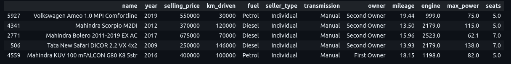

<h1>Predict Auto Prices using Machine Learning in Python at ISB</h1>
 
<h2>Features</h2>
<ul>
  <li>Import CSV file with code</li>
  <li>Check if, in the mileage column, there is one or more units of measure. For example, there is certainly the unit of measure kmpl - km per liter; are there others? If so, how many records are there for each unit of measure?</li>
  <li>Are there vehicles with gasoline or diesel engines, for which the unit of measurement in the mileage column is in km/kg? If so, display those records.</li>
  <li>Apparently, in the engine column the displacement is expressed only in cubic centimeters (CC), and the max_power column contains values ​​expressed only in wheel horse power (bhp - break horse power). Similar to point 1 above, it analyzes whether the engine and max_power attributes still contain values ​​expressed in other units of measurement.</li>
  <li>Check how many values ​​are missing from each column. Display the result both in absolute value and in percentage.</li>
  <li>Keep only the numeric part in the mileage, engine and max_power columns.</li>
</ul>

<h2>Acknowledgments</h2>

<b> Python3: http://bit.ly/python3-certifications <b>
 

<h2>Dataset CSV</h2>
<b> Link: http://isb.pub.ro/docs/auto.csv
 

<h2>Photo</h2>

 

<h2>Contact</h2>

<b> Email: mariusc0023@gmail.com </b>
